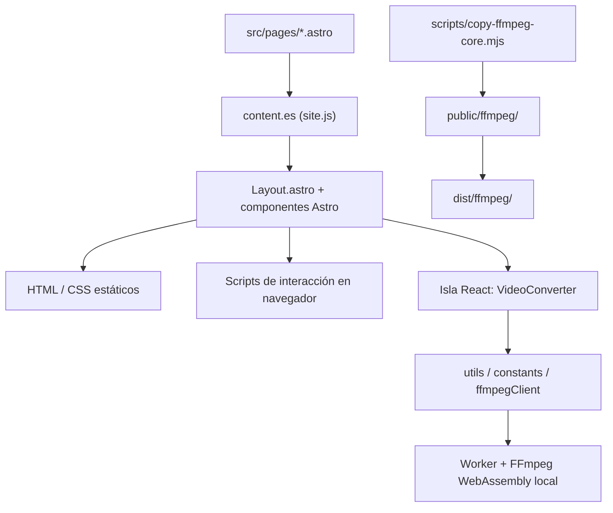

# Arquitectura y stack

Sitio estático generado con Astro. React se usa exclusivamente como isla para el conversor de vídeo (`client:only="react"`); todo lo demás es HTML/CSS/Astro más scripts de interacción en navegador (GSAP, IntersectionObserver, CSS).

## Flujo de datos

## Estructura principal

- `src/pages/`: cuatro rutas. No hay endpoints `.ts`/`.js` ni `pages/api` — no hay backend.
- [Layout.astro](../../src/layouts/Layout.astro): documento HTML, metadatos, fuentes, tokens, estilos compartidos, reveals y comportamiento de clic central. Ver [[03-Sistema-de-Diseno|Sistema-de-Diseno]] y [[04-Accesibilidad-y-Movimiento|Accesibilidad-y-Movimiento]].
- `src/components/`: secciones, páginas de contenido y primitivas. `VideoConverter/` contiene siete componentes React y su CSS Module. Ver [[Hero-y-Sidebar]], [[Sobre-Mi]], [[Otras-Secciones-y-Compartidos]], [[Conversor-de-Video]].
- [site.js](../../src/content/site.js): exporta `{ es, en }`. Cada ruta actual elige `content.es` y lo pasa como prop `t`. Ver [[Contenido-por-Seccion]] y [[Bilingue-ES-EN]].
- [content-types.ts](../../src/lib/content-types.ts): contratos de contenido, secciones y locales. **No** es validación en tiempo de ejecución — solo tipos.
- `src/lib/forms/`: tipos, validación y simulación de envío. Ver [[Formularios]].
- `src/lib/videoConverter/`: formatos, límites, metadatos, nombres y cliente FFmpeg. Ver [[Conversor-de-Video]].
- [src/lib/paths.js](../../src/lib/paths.js): `withBase(path)` quita la barra final de `BASE_URL` y concatena el destino. Espera rutas internas con barra inicial (`/tools/`); no normaliza URLs externas.
- `public/assets/`: fuentes, favicon, imágenes y skills. `public/ffmpeg/` se genera después de instalar dependencias (no se versiona el WASM generado). Ver [[Recursos-Estaticos]].
- [.claude/launch.json](../../.claude/launch.json): config local para `npm run dev`, puerto 4321, `autoPort: true`. No es despliegue ni CI.

## Dependencias resueltas (`package-lock.json`)

Versiones exactamente instaladas, no recomendaciones:

| Dependencia | Versión | Uso |
|---|---|---|
| Astro | 7.3.5 | Generación del sitio |
| `@astrojs/react` | 7.0.0 | Integración de la isla React |
| React / React DOM | 18.3.1 / 18.3.1 | Conversor de vídeo |
| GSAP | 3.15.0 | Entrada, morph y ScrollTrigger del Hero |
| `lucide-astro` | 0.469.0 | Siete iconos de navegación del sidebar |
| `@ffmpeg/core` | 0.12.10 | Núcleo JS/WASM monohilo |
| `@ffmpeg/ffmpeg` | 0.12.15 | API del Worker |
| `@ffmpeg/util` | 0.12.2 | Lectura de archivos y URLs del motor |
| TypeScript | 5.9.3 | Tipos |
| `@astrojs/check` | 0.9.10 | Diagnósticos de Astro |
| `@types/react` / `@types/react-dom` | 18.3.31 / 18.3.7 | Tipado React |
| Vite / Rolldown | 8.3.2 / 1.2.12 | Herramientas transitivas de compilación |

## Configuración

- `package.json`: declara ESM y Node `>=22.12.0`.
- `astro.config.mjs`: registra la integración `react()` y preoptimiza `react-dom/client` vía `vite.optimizeDeps.include` (fix de un bug de hidratación en dev — ver [[Hallazgos-y-Pendientes]]). No configura `site`, `base`, adaptador ni `output`; el build confirma salida estática.
- `tsconfig.json`: extiende `astro/tsconfigs/strict`, configura JSX de React, incluye `**/*` y excluye `dist`.

## Lo que no existe

No hay Dockerfile, Compose, ORM, migraciones, servidor backend, cola de tareas, pruebas automatizadas propias ni workflow de GitHub Actions. No hay configuración de hosting que identifique dominio o despliegue real.

## Relacionado

[[02-Rutas-y-Navegacion|Rutas-y-Navegacion]] · [[Comandos-y-Pruebas]] · [[Archivos-del-Proyecto]]
